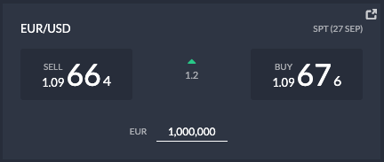
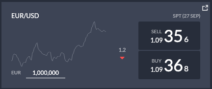
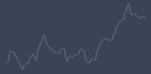
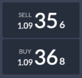

### Spot Tile Component:  

Spot tile files are located in `../apps/MainRoute/widgets/spotTile/`.

Components relevant to the Spot Tile component: 
- `./SpotTileContainer.tsx`: shows either the `<Loadable />` component or the `<TileSwitch />` component.
  
- `./TileSwitch.tsx`: shows the `<Tile />` component and conditionally renders the necessary *tile controls*, see price controls.
  
- `./components/Tile.tsx`: depending on the view (Normal or Analytics) shows either the `<SpotTile />` component or the `<AnalyticsTile />` component.

- #### __Spot Tile Normal View:__  
    
  File location: `./components/SpotTile.tsx`

    - #### __Spot Tile Header:__
      **Browser**  
        
      **OpenFin**  
        
      File location: `./components/TileHeader.tsx`

        Comments:
        - Depending on the platform RTC is being ran on, this tile header will render a ChartIQ button or a share button. Hence the `{platform.hasFeature('chartIQ')}` and `{platform.hasFeature('share')}` scripts.

    - #### __Price Controls:__
        
      File location: `./components/PriceControls/PriceControls.tsx`

        Components within `<Price Controls />`:
        - __Buy and Sell buttons:__ `./components/PriceButton/PriceButton.tsx`
        - __Price movement component:__ `./components/PriceMovement.tsx`
        
        Comments:
        - Price controls have several states depending on the situation: (see `TileSwitch.tsx` component)
          - Normal (shown above):
            - Sell price shown
            - Buy price shown
            - Price change shown
          - *Executing* a trade (buy/sell):  
          
            - Executing loader shown
            - Sell button disabled
            - Buy button disabled
          - When notional is greater than or equal to 10m:  
          
            - Initiate RFQ button is shown
            - Sell button says *Streaming Price Unavailable*
            - Buy button says *Streaming Price Unavailable*
          - When Initiate RFQ is pressed - and the tile is *awaiting* for a price:  
          
            - Cancel RFQ button is shown (for a brief second)
            - Awaiting price loader is shown in place of Sell/Buy buttons (for a brief second)
          - When RFQ price has loaded and the 10sec timer begins:  
          
            - RFQ sell price shown (red color fades as timer runs out)
            - RFQ buy price shown (blue color fades as timer runs out)
            - RFQ price change shown
          - When RFQ price becomes stale (expires):  
          
            - Sell button disabled (showing the stale price)
            - Buy button disabled (showing the stale price)
            - Requote button shown

    - #### __Spot Tile Notional Input:__  
        
      File location: `./components/notional/NotionalInput.tsx`

        Comments:
        - Input values greater than or equal to 10,000,000 (10m) causes this component to show the `<ResetInputValue />` button component to show - located in the same file.
        - Input values greater than 1,000,000,000 (1b) causes this component to show the `<MessagePlaceholder />` component - located in the same file.  
        
        - Notional input component has the functionally to receive `${Number}m` as input (i.e. `1m = 1,000,000`, `1k = 1,000`) 

- __Spot Tile Analytics View:__  
    
  File location: `./components/analyticsTile/AnalyticsTile.tsx`

    - __Spot Tile Analytics Chart:__  
      
    File location: `./components/analyticsTile/AnalyticsTileChart.tsx`

    - __Price Controls:__  
      
    File location: `./components/analyticsTile/AnalyticsTilePriceControl.tsx`
  
    - Other components that belong in the `<AnalyticsTile />` like the `<TileHeader />`, `<NotionalInput>` and conditionally rendered *tile controls* (see comments on price controls above) are all similar to the __Spot Tile Normal View__ shown above.